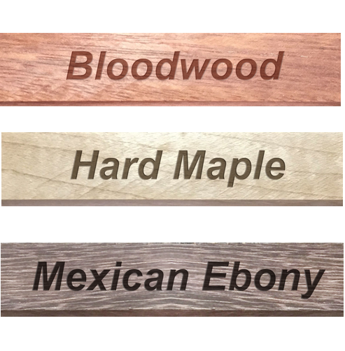

# Wood Species Classification Using Vibration Signature
 
Acquire live data from NI data acquisition hardware in MATLAB using the Data Acquisition Toolbox and use the Deep Learning Toolbox to classify 3 different wood species (Mexican Ebony, Hard Maple and Bloodwood) based on vibrational characteristics. 
This demo also uses the Wavelet Toolbox to compute continuous wavelet transform (CWT) images of the live acquired data samples. The CWT images were used to train our CNN model.
   

## Wood Species

The convolution neural network (CNN) was trained on vibrational data samples acquired from 3 different varieties of wood species known as:

* Mexican Ebony
* Hard Maple
* Bloodwood
    

## Hardware Setup

Configure the hardware - Connect NI 9234 data acquisition module with the impact hammer and accelerometers as follows:

* Channel 0 - PCB 086C03 Impact Hammer
* Channel 1 - PCB 352C65 Accelerometer
* Channel 2 - PCB 352C65 Accelerometer
* Channel 3 - PCB 352C65 Accelerometer

Mount the 3 accelerometers on separate wood species blocks (Mexican Ebony, Hard Maple and Bloodwood).

## Data Acquisition 

Data Acquisition Toolbox was used to acquire vibrational signals from NI 9234 DAQ module. Data Acquisition Toolbox provides functions for configuring data acquisition hardware and reading data into MATLAB for analysis.
The toolbox supports a variety of DAQ hardware, including USB, PCI, PCI Express®, PXI®, and PXI-Express devices, from National Instruments™ and other vendors.

Thse following link provides more information about the Data Acquisition Toolbox:

https://www.mathworks.com/products/data-acquisition.html

## Signal Processing

Vibrational data from the accelerometers mounted on wood blocks was acquired using NI 9234 DAQ module in MATLAB. Signal samples were analyzed and preprocessed in MATLAB. Continuous Wavelet Transforms (CWT) were used 
to generate the 2-D time-frequency maps of time series data. These time-frequency maps were used as inputs for the deep convolutional neural network (CNN). The ability of the CWT to simultaneously capture steady-state
and transient signal behavior in time series data makes the wavelet-based time-frequency representation particularly robust when paired with deep CNNs.

For more information about Wavelet Transforms and time-frequency analysis, visit the following link:

https://www.mathworks.com/help/wavelet/time-frequency-analysis.html   

## Goal

* Configure Hardware
* Strike wood block with the impact hammer
* Accelerometer captures wood specific vibrational data
* Classification model predicts the type of wood based on impact

## Demo Video

This demo was showcased in MathWorks/NI virtual event. The name of the session was - Data Acquisition and Machine Learning Using MathWorks and NI Tools. 
The session provides insights into a typical machine learning workflow and how one can use machine learning to classify materials followed by a live demo showcase.
Link for the virtual session:

https://gateway.on24.com/wcc/eh/2429684/lp/2748276/data-acquisition-and-machine-learning-using-mathworks-and-ni-tools

## Demo Setup

* From a list of MATLAB files in the 'wood classification demo' folder, open and run the demoSetup.m script in MATLAB. This script clears everything in MATLAB editor and sets it up for running the demo.
* To start the demo, please run the startDaq.m script.

Copyright 2021 The MathWorks, Inc.